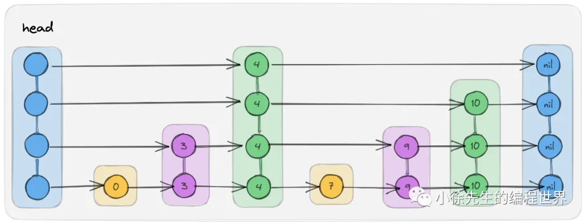

# SkipList

参考：[基于golang从零到一实现跳表 ](https://mp.weixin.qq.com/s?__biz=MzkxMjQzMjA0OQ==&mid=2247484204&idx=1&sn=54817591aa44359cde9b1b88d386b31b)

跳表，简单来说就是对于单向有序链表的改进。

单向有序链表，插入和删除相比数组要方便很多，但是查找性能很差，插入和删除节点也需要从头开始一直往后遍历查找，最坏情况会一直到链表末尾。

跳表就是改进其性能的一种数据结构，一个跳表的样例图如下：

- 跳表由多层索引组成
- 每一层的节点个数约为下一层节点数的一半
- 对于一个在 m 层存在的节点，在 0 ~ m-1 层，也存在该节点
- 为保持连贯性，用一个公共头节点来连接每层的起始点
- 其特点在于，每次检索时，先从更高的层开始检索，只要在更高的层经过一个节点，就相当于在最底层跳过了很多个节点，从而加速检索

具体的代码实现就不解析了，文章里面有写，代码也有手敲一遍。

虽然插入的处理不太喜欢，但是总体来看还是很不错的。

